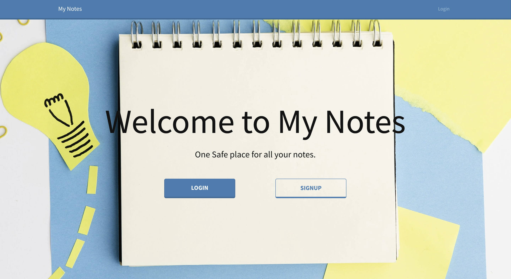
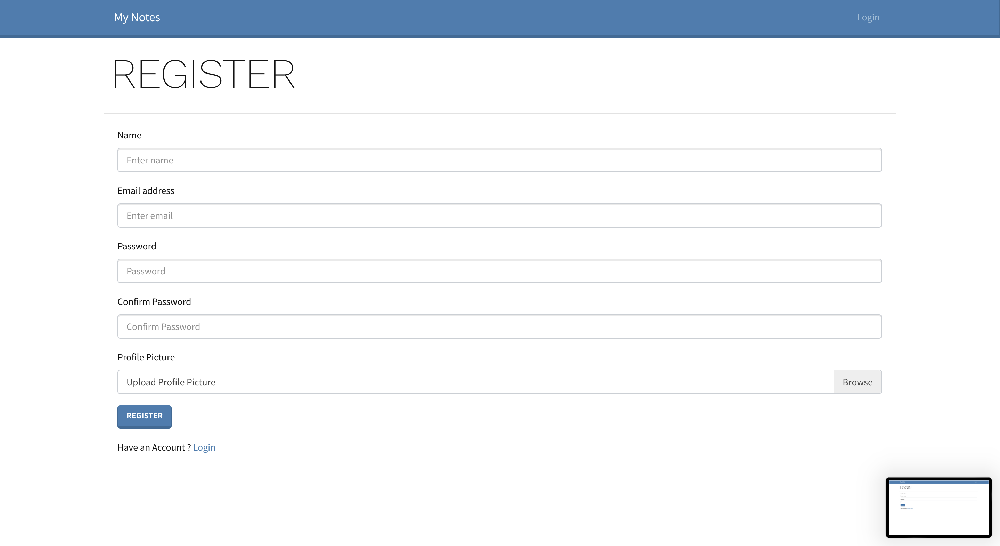
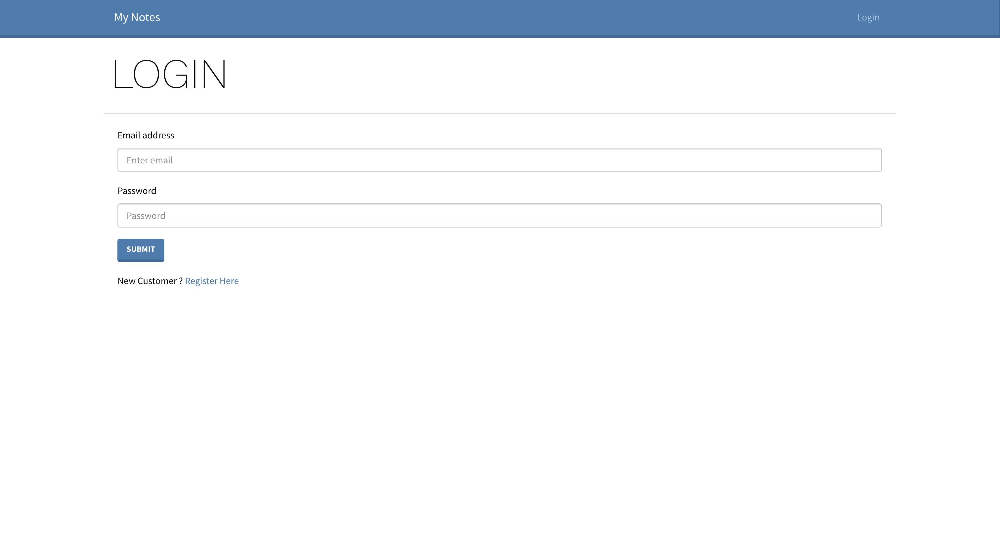
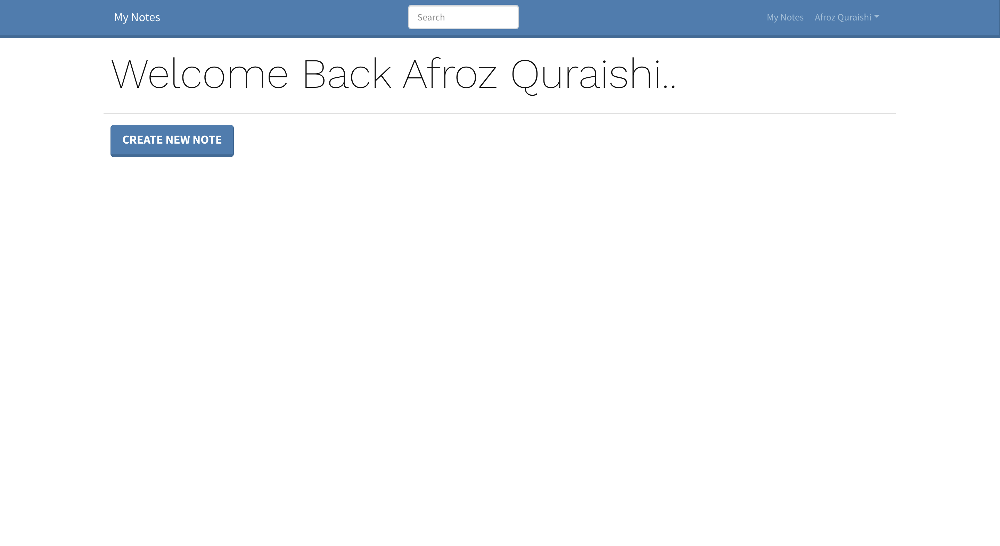
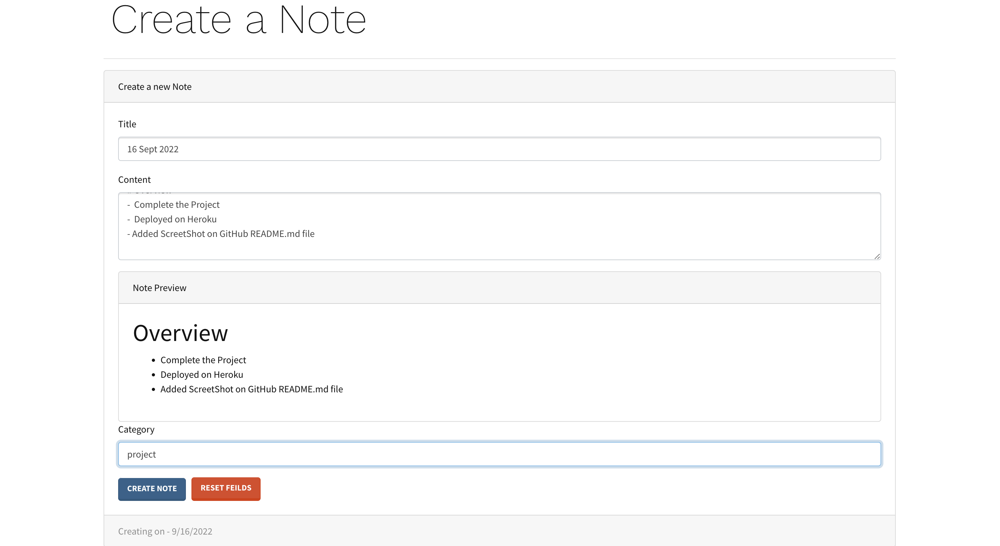
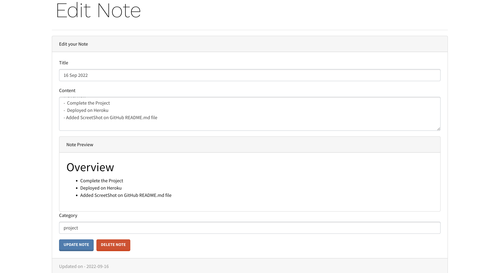
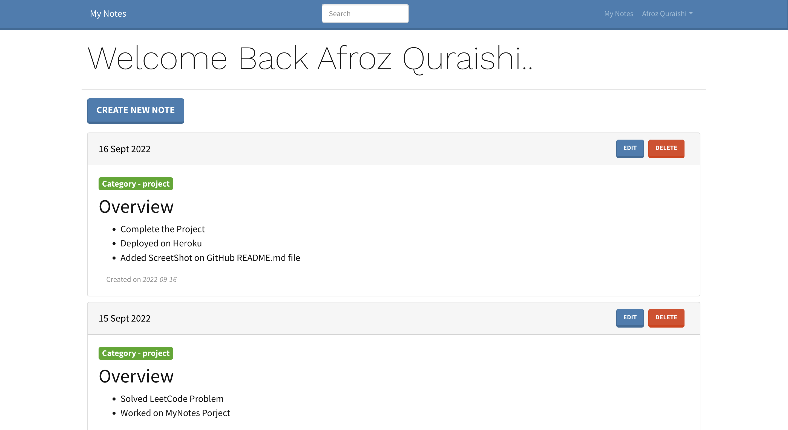

# Notes Taking App

This web application will help you to store all your notes in a Markdown fashion in a specific tag.

## Deployment
[Live Link](https://mynotes-afroz.herokuapp.com/)

## Features
- User can Create, Delete, Edit and Update Note.
- Authentication Added via JWT(JSON web token).
- User can write `MARKDOWN` or simple text while creating new note.
- Search by Notes Title.

## Objectives

- One Safe place for all your notes.

## Features

- Great design and functionality.
- User can share there Interview Experience.
- User can like, delete and edit there exprience.
- If you try to add interview experience with blank fields then you will get error accordingly.

## Home page

## SignUp Page

## LogIn Page

## Dashboard(After LogIn)

## Create New Note Page

## Edit Note Page

## Home page after creating multiple Notes

## Technologies Details

### Backend Technologies

- Node, Express

### Frontend Technologies

- ReactJs, Material Ui, Redux

### Database

- MongoDB, mongooose

## Setup

- client side \
 Go to frontend directory and run `npm i && npm start` command.
- server side\
 Go to root directory and run `npm i && npm start` command.